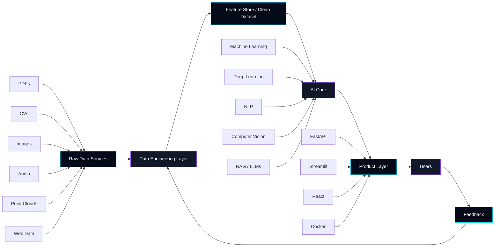
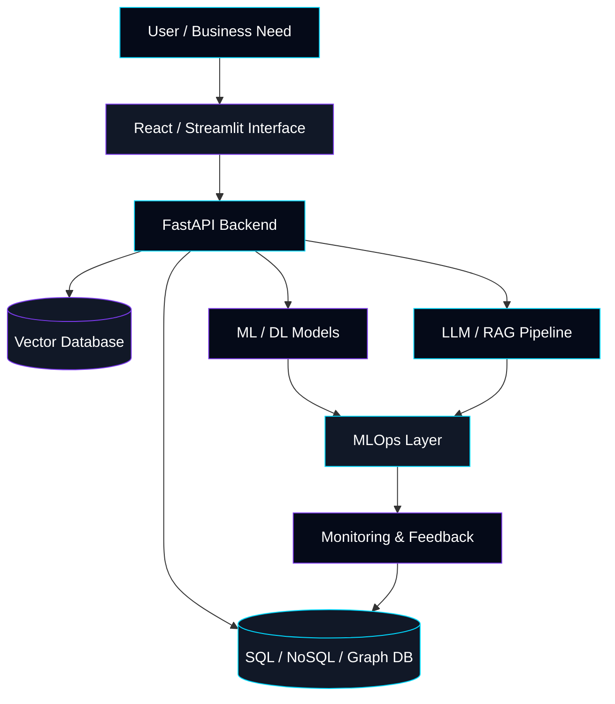
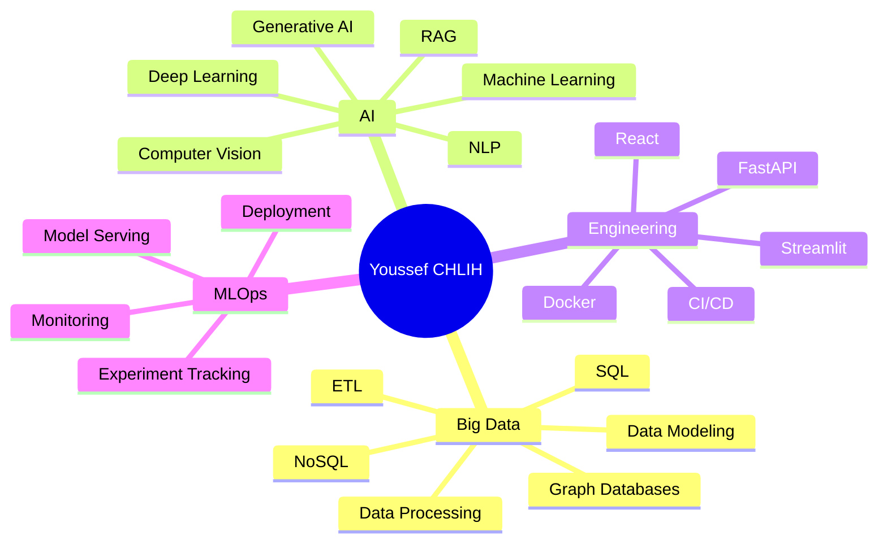
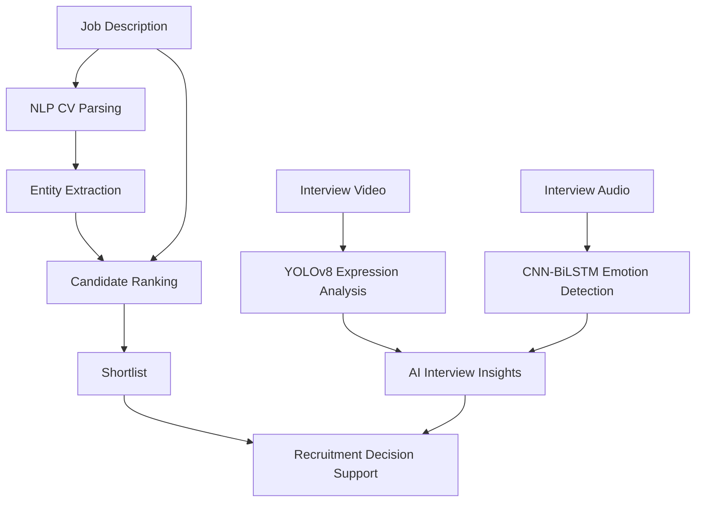
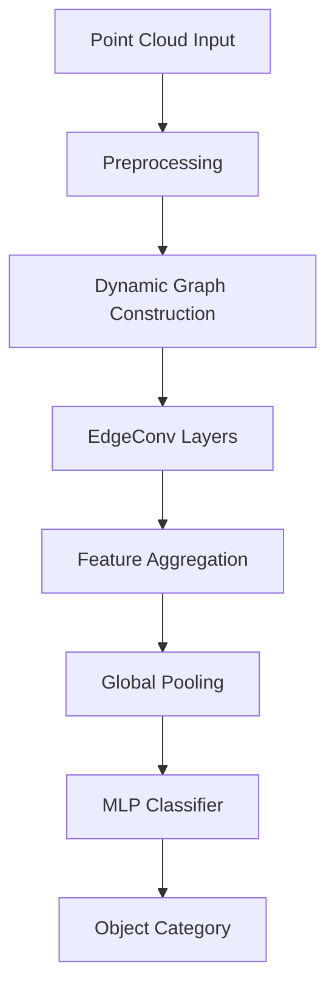
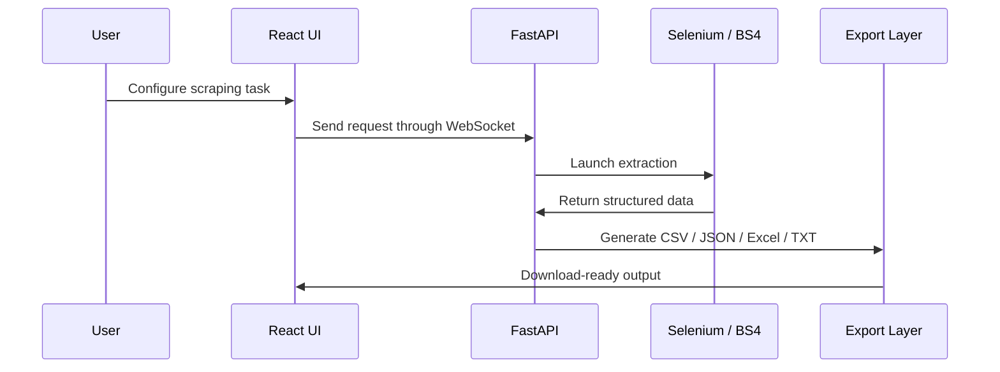
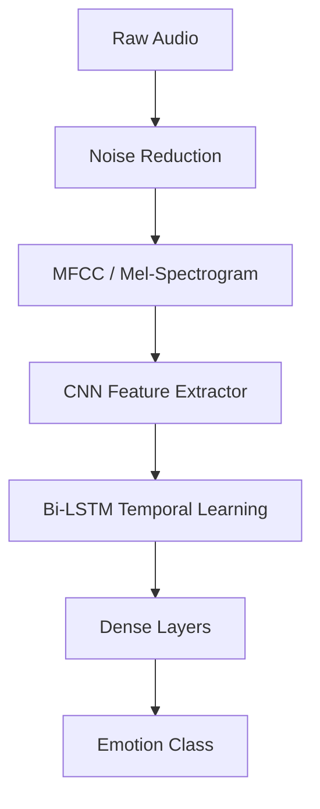
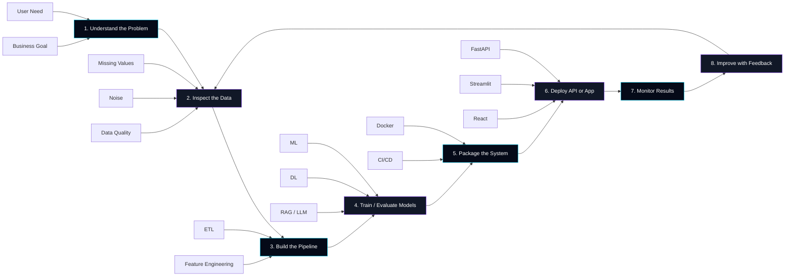

<!--
  GitHub Profile README
  Name preserved: Youssef CHLIH
  Focus: Big Data · Artificial Intelligence · Data Engineering · MLOps
-->

<div align="center">


# Youssef CHLIH


<br/>

<table>
<tr>
<td align="center">

### Data is the raw material.  
### AI is the engine.  
### Engineering is how it reaches real users.

I build systems that move from **messy data** to **usable intelligence**:  
data pipelines, machine learning models, deep learning systems, APIs, dashboards, automation tools, and deployable AI products.

</td>
</tr>
</table>

<br/>

<a href="https://linkedin.com/in/youssef-chlih">
  
</a>
<a href="mailto:youssefchlih.ai@gmail.com">
  
</a>
<a href="https://github.com/YoussefChlih">
  
</a>

<br/><br/>


</div>

---

## Digital Identity

```txt
Big Data + AI + Engineering

I do not only build models.
I build the complete path around them:

Data Source
   ↓
Data Pipeline
   ↓
AI Model
   ↓
API
   ↓
Interface
   ↓
Deployment
   ↓
User Feedback
```

---

## Intelligence Factory

<div align="center">



</div>

---

## About Me

```python
class YoussefCHLIH:
    identity = "Big Data & Artificial Intelligence Engineer"
    location = "Morocco"

    def build(self):
        return [
            "Data pipelines that transform messy data into usable knowledge",
            "Machine learning systems for prediction, ranking, and classification",
            "Deep learning models for vision, audio, NLP, and 3D data",
            "AI applications with APIs, dashboards, and deployment workflows",
            "RAG and LLM-based systems connected to real business data"
        ]

    def specialize_in(self):
        return {
            "Big Data": [
                "ETL pipelines",
                "Data modeling",
                "SQL and NoSQL databases",
                "Graph databases",
                "Data preprocessing",
                "Analytics workflows"
            ],
            "Artificial Intelligence": [
                "Machine Learning",
                "Deep Learning",
                "Natural Language Processing",
                "Computer Vision",
                "Generative AI",
                "RAG systems"
            ],
            "Engineering": [
                "FastAPI",
                "Streamlit",
                "React",
                "Docker",
                "CI/CD",
                "Cloud deployment"
            ]
        }

    def goal(self):
        return "Build useful, scalable, and deployable AI systems from real-world data."
```

---

## Professional Map

<table>
<tr>
<td width="50%" valign="top">

### Big Data Engineering

I work on the technical foundation that makes AI reliable.

- Data collection
- Data cleaning
- ETL / ELT pipelines
- SQL and NoSQL modeling
- Feature engineering
- Data validation
- Analytics-ready datasets
- Graph and vector-based data structures

</td>
<td width="50%" valign="top">

### Artificial Intelligence

I build systems that learn from data and support real decisions.

- Machine Learning
- Deep Learning
- Natural Language Processing
- Computer Vision
- Audio intelligence
- 3D object recognition
- RAG pipelines
- LLM experimentation

</td>
</tr>
</table>

---

## System Architecture

<div align="center">



</div>

---

## Technical Stack

<div align="center">

### AI / Machine Learning


<br/>

`Machine Learning` · `Deep Learning` · `NLP` · `Computer Vision` · `RAG` · `LLM Fine-tuning` · `Prompt Engineering` · `Feature Engineering`

---

### Big Data / Databases


<br/>

`ETL` · `SQL` · `NoSQL` · `Graph Databases` · `Vector Search` · `Data Modeling` · `Data Processing`

---

### Backend / Apps / Automation


<br/>

`REST APIs` · `WebSocket` · `Dashboards` · `Web Scraping` · `Automation` · `AI Backends`

---

### DevOps / MLOps / Cloud


<br/>

`Docker` · `CI/CD` · `Model Serving` · `Experiment Tracking` · `Deployment` · `Cloud AI`

</div>

---

## Skill Radar



---

## Featured AI Systems

<table>
<tr>
<td width="50%" valign="top">

## HireGenius

### AI Recruitment Intelligence Platform

A multi-modal AI system designed to help recruitment teams process candidates faster and more consistently.



**Key features**

- CV parsing
- Candidate-job matching
- NLP-based ranking
- Facial expression analysis with YOLOv8
- Speech emotion detection with CNN-BiLSTM
- AI-assisted recruitment decision support

**Stack**

`Python` · `spaCy` · `YOLOv8` · `CNN-BiLSTM` · `FastAPI` · `HTML` · `JavaScript`

<a href="https://github.com/YoussefChlih/Cv-Ranking">
  
</a>

</td>
<td width="50%" valign="top">

## 3D Object Recognition

### Point Cloud Classification with DGCNN

A deep learning system for understanding 3D objects from point cloud data.



**Key features**

- Point cloud preprocessing
- DGCNN-based classification
- ModelNet10 categories
- Real-time Streamlit interface
- Full AI workflow from training to inference

**Stack**

`Python` · `TensorFlow` · `DGCNN` · `Open3D` · `Streamlit`

<a href="https://github.com/YoussefChlih/3d-obj-rec">
  
</a>

</td>
</tr>

<tr>
<td width="50%" valign="top">

## Web Scraping Agent

### Full-Stack Data Extraction Tool

A web automation platform that extracts, structures, and exports data.



**Key features**

- Real-time scraping workflow
- Browser automation
- Structured data export
- WebSocket communication
- Data processing with Pandas

**Stack**

`React` · `FastAPI` · `Selenium` · `BeautifulSoup` · `Pandas` · `WebSocket`

<a href="https://github.com/YoussefChlih/web_scraping_agent">
  
</a>

</td>
<td width="50%" valign="top">

## Speech Emotion Detection

### Audio Intelligence with CNN-BiLSTM

A deep learning model that classifies human emotion from speech signals.



**Key features**

- Audio preprocessing
- MFCC and Mel-Spectrogram extraction
- CNN-BiLSTM architecture
- Multi-class emotion classification

**Stack**

`Python` · `TensorFlow` · `Librosa` · `CNN-BiLSTM`

<a href="https://github.com/YoussefChlih/Speech_emotion_detection">
  
</a>

</td>
</tr>
</table>

---

## AI Use Cases I Can Build

<table>
<tr>
<td width="33%" valign="top">

### Business AI

- Candidate ranking
- Document intelligence
- Predictive dashboards
- Automated reporting
- Decision support systems

</td>
<td width="33%" valign="top">

### Data Products

- ETL pipelines
- Data APIs
- Scraping systems
- Analytics dashboards
- Database-backed platforms

</td>
<td width="33%" valign="top">

### Advanced AI

- RAG assistants
- LLM workflows
- Computer vision systems
- Audio classification
- 3D recognition systems

</td>
</tr>
</table>

---

## Project Matrix

```mermaid
flowchart TB
    A[Project Portfolio] --> B[AI-heavy Systems]
    A --> C[Data-heavy Systems]
    A --> D[Product Engineering]
    A --> E[Research / Exploration]

    B --> B1[HireGenius]
    B --> B2[Speech Emotion Detection]
    B --> B3[3D Object Recognition]

    C --> C1[Web Scraping Agent]
    C --> C2[IT Fault Detection]
    C --> C3[Data Cleaning Pipelines]

    D --> D1[FastAPI Backends]
    D --> D2[Streamlit Apps]
    D --> D3[React Dashboards]

    E --> E1[RAG Systems]
    E --> E2[LLM Fine-tuning]
    E --> E3[GAN Image Generation]

    style A fill:#050A18,stroke:#00D9FF,color:#fff
    style B fill:#111827,stroke:#7C3AED,color:#fff
    style C fill:#111827,stroke:#00D9FF,color:#fff
    style D fill:#111827,stroke:#7C3AED,color:#fff
    style E fill:#111827,stroke:#00D9FF,color:#fff
    style B1 fill:#050A18,stroke:#00D9FF,color:#fff
    style B2 fill:#050A18,stroke:#00D9FF,color:#fff
    style B3 fill:#050A18,stroke:#00D9FF,color:#fff
    style C1 fill:#050A18,stroke:#7C3AED,color:#fff
    style C2 fill:#050A18,stroke:#7C3AED,color:#fff
    style C3 fill:#050A18,stroke:#7C3AED,color:#fff
    style D1 fill:#050A18,stroke:#00D9FF,color:#fff
    style D2 fill:#050A18,stroke:#00D9FF,color:#fff
    style D3 fill:#050A18,stroke:#00D9FF,color:#fff
    style E1 fill:#050A18,stroke:#7C3AED,color:#fff
    style E2 fill:#050A18,stroke:#7C3AED,color:#fff
    style E3 fill:#050A18,stroke:#7C3AED,color:#fff
```



---

## Experience

```text
AI Developer Intern
3d Smart Factory · Feb 2025 – Jun 2025 · Mohammedia

→ Built a 3D object classification system using DGCNN
→ Worked with point cloud data and ModelNet10
→ Developed an interactive Streamlit inference application
→ Covered preprocessing, training, evaluation, and deployment


AI Development Intern
HardTech Maroc · Aug 2024 – Sep 2024 · Casablanca

→ Built an ML-based IT fault detection system
→ Worked on infrastructure data preprocessing
→ Developed predictive models for failure anticipation
→ Contributed to data analysis and model evaluation


DUT — Artificial Intelligence & Data Engineering
EST Nador · 2023 – 2025

→ Machine Learning
→ Deep Learning
→ Big Data
→ NLP
→ Computer Vision
→ Databases
→ DevOps
```

---

## AI Engineering Workflow



---

## Current Learning Direction

```yaml
focus:
  - Advanced Big Data pipelines
  - RAG systems with vector databases and graph databases
  - LLM fine-tuning and evaluation
  - Production-ready MLOps
  - Cloud deployment for AI applications

goal:
  - Build AI systems that are technically solid
  - Make data useful for real users
  - Move from notebooks to deployed products
```

---

## Certifications

| Certificate | Issuer | Domain | Year |
|---|---|---|---|
| Oracle Cloud Infrastructure — Generative AI Professional | Oracle | Cloud + GenAI | 2025 |
| ML Engineering for Production — MLOps Level 2 | Coursera | MLOps | 2024 |
| Oracle Certified Foundations Associate — OCI 2024 | Oracle | Cloud | 2024 |
| Machine Learning A-Z | 365 Data Science | Machine Learning | 2024 |
| Python Programmer Bootcamp | 365 Data Science | Python | 2024 |
| Introduction to Data Science | Cisco Academy | Data Science | 2024 |

---

## GitHub Analytics

<div align="center">


<br/><br/>


<br/><br/>


<br/><br/>


<br/><br/>


<br/><br/>


<br/><br/>


</div>

---

## Repository Signals

<div align="center">


<br/><br/>


</div>

---

## Contribution Graph

<div align="center">


</div>

> Note: The contribution snake needs a GitHub Action to generate the SVG in the `output` branch.

---

## Collaboration

I am open to projects and opportunities in:

- Big Data Engineering
- AI Engineering
- Machine Learning
- Deep Learning
- RAG and LLM applications
- Computer Vision
- NLP systems
- Data automation
- MLOps and deployment

---

<div align="center">

## From data chaos to intelligent systems.

<br/>

<a href="https://linkedin.com/in/youssef-chlih">
  
</a>
<a href="mailto:youssefchlih.ai@gmail.com">
  
</a>

<br/><br/>


</div>
